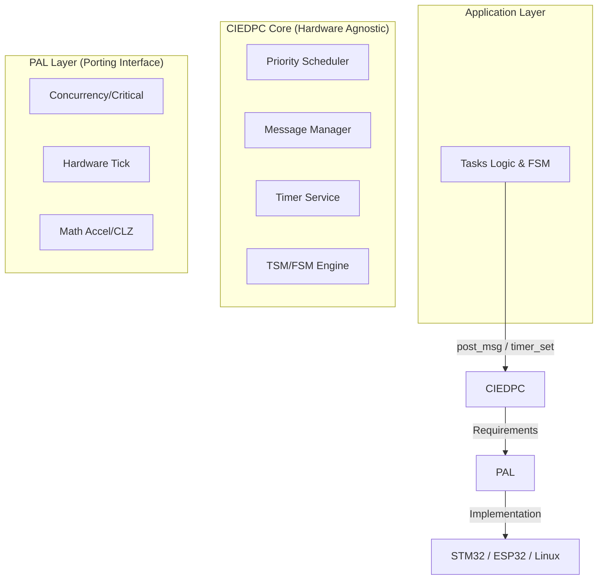

# CIEDPC: Custom Independent Event-Driven Programming Core


**CIEDPC** là một hạt nhân (Kernel) lập trình hướng sự kiện siêu nhẹ, hiệu suất cao, được thiết kế tham khảo theo mô hình **Active Object** với các tùy chỉnh bổ sung. Mục tiêu cốt lõi là đạt được khả năng **"Zero-Touch Porting"** – cho phép di chuyển toàn bộ logic ứng dụng giữa các nền tảng (như từ STM32 sang Linux mô phỏng) mà không cần thay đổi mã nguồn lõi.

---

## 🚀 Tính năng nổi bật

- **Kiến trúc Tách biệt Tuyệt đối:** Phân tầng rõ rệt giữa App Layer - CIEDPC Core - PAL (Platform Abstraction Layer).
- **Bộ lập lịch O(1):** Lập lịch đa nhiệm ưu tiên dựa trên Bitmask, tối ưu hóa tốc độ phản ứng với sự kiện.
- **Quản lý Bộ nhớ Tĩnh (Static Memory Pools):** Triệt tiêu hoàn toàn hiện tượng phân mảnh RAM (Fragmentation), đảm bảo tính đoán định (Deterministic) cho hệ thống Real-time.
- **Hệ thống Tin nhắn Hợp nhất (Unified Messaging):** Tự động thích ứng kích thước con trỏ (4-byte trên 32-bit, 8-byte trên 64-bit), hỗ trợ cả truyền tham trị (Value) và tham chiếu (Zero-copy).
- **Cơ chế "Lớp vỏ & Lõi" (TSM & FSM):**
  - **TSM (Table-driven):** Quản lý chế độ vận hành lớn với Entry/Exit actions tự động.
  - **FSM (Pointer-driven):** Xử lý logic nghiệp vụ chi tiết linh hoạt.
- **Simulation Ready:** Hỗ trợ mô phỏng hoàn hảo trên Linux POSIX giúp kiểm thử logic 100% trước khi nạp xuống phần cứng.

---

## 🏗 Kiến trúc Hệ thống



---

## 📂 Cấu trúc thư mục

```text
CIEDPC/
├── core/                 # Định nghĩa và triển khai logic chính của CIEDPC
│   ├── inc/              # ciedpc_msg.h, ciedpc_task.h, ciedpc_timer.h, ciedpc_fsm.h, ciedpc_tsm.h
│   │   └── ciedpc_core.h # Định nghĩa các tín hiệu, hằng số và cấu trúc dữ liệu cốt lõi của CIEDPC
│   └── src/              # Triển khai logic scheduler, timer engine, message manager
├── pal/                  # BACKEND (Lớp trừu tượng)
│   ├── pal_core.h        # Khai báo thống nhất chung cho toàn bộ PAL và các dịch vụ hệ thống
│   ├── services/         # Hardware Services (Mapping phần cứng)
│   │   ├── timer/        # pal_timer.h chứa các khai báo API timer để tự triển khai trên từng nền tảng
│   │   └── memrp/        # pal_memrp.c/h chứa các hàm hỗ trợ memory profiling
│   └── arch/             # Implementation (Mã nguồn chi tiết từng chip)
│       ├── stm32/        # stm32_arch.c/h chứa các hàm triển khai cho STM32
│       └── linux/        # linux_arch.c/h chứa các hàm triển khai cho môi trường giả lập trên Linux
├── app/                  # Định nghĩa logic ứng dụng, bao gồm các tác vụ và FSM do người dùng tạo ra
│   ├── config/           # Chứa cấu hình ứng dụng và cấu hình người dùng
│   ├── task/             # Định nghĩa các tác vụ (tasks) và FSM của người dùng
│   ├── declaration/      # Implementation chính của logic hoạt động của ứng dụng người dùng
│   └── interface/        # Định nghĩa và triển khai cổng giao tiếp với tín hiệu bên ngoài (task_if)
├── common/               # Các tiện ích và cấu trúc dữ liệu chung được sử dụng trong toàn bộ dự án
│   └── container/        # Các cấu trúc dữ liệu như FIFO, Ring Buffer, Linked List được triển khai thuần C
└── test/                 # Các bài kiểm tra tích hợp (Integration Tests) để đảm bảo tính đúng đắn của hệ thống
    ├── test01/           # Test cơ bản với các tác vụ ISR và TSM
    ├── test02/           # Test với các tính năng như message pooling và memrp
    └── test03/           # Test tích hợp FSM phức tạp
```

---

## 🛠 Hướng dẫn Khởi chạy nhanh (Linux Simulation)

CIEDPC hỗ trợ chạy mô phỏng ngay trên môi trường Linux để kiểm tra logic.

### 1. Yêu cầu

- GCC Compiler
- CMake (version 3.10+)

### 2. Biên dịch

```bash
mkdir build && cd build
cmake -DPLATFORM=LINUX ..
make
```

### 3. Chạy Integration Test

```bash
./ciedpc_test
```

*Kết quả sẽ hiển thị luồng chuyển trạng thái TSM/FSM và hoạt động của Timer Service trên Terminal.*

---

## 📖 Nguyên lý "Lớp vỏ & Lõi"

CIEDPC giải quyết bài toán phức tạp bằng cách lồng ghép hai loại máy trạng thái:

1. **TSM (Macro-level):** Quản lý các "Chế độ" (ví dụ: `IDLE`, `RUNNING`, `ERROR`). Nó tự động dọn dẹp tài nguyên khi Task đổi chế độ thông qua hàm `on_exit`.
2. **FSM (Micro-level):** Quản lý "Hành vi" bên trong từng chế độ (ví dụ: giải mã gói tin UART byte-by-byte).

Cơ chế này giúp loại bỏ hoàn toàn các biến cờ (`flags`) lộn xộn, biến mã nguồn trở thành một bản mô tả sơ đồ logic sạch sẽ.

---

## 📝 Tài liệu hướng dẫn

Thông tin chi tiết về API, cách quy hoạch Pool bộ nhớ và hướng dẫn Porting sang các MCU khác có thể tìm thấy trong tài liệu [User Manual (PDF)](./docs/user-manual.md).

---

## 🤝 Đóng góp

Dự án được phát triển bởi **Shang Huang (Huỳnh Thanh Sang)**. Mọi đóng góp về lỗi (bugs) hoặc đề xuất tính năng (features) xin vui lòng tạo Issue trên GitHub.

**License:** MIT.

---

## Roadmap tương lai

Đây là các lộ trình triển khai dự kiến trong tương lai để hoàn thiện và mở rộng tính năng của CIEDPC:

- Triển khai PAL services cho RAM profiling.
- Triển khai PAL services cho Debug.
- Triển khai PAL services cho Tracing và Fatal Error Handling.
- Bổ sung các xử lý cho giao diện thu thập tín hiệu từ bên ngoài.
- Mở rộng thêm các bài kiểm tra tích hợp (Integration Tests) để đảm bảo tính ổn định của hệ thống.
- Phát triển thêm các ví dụ ứng dụng thực tế để minh họa cách sử dụng CIEDPC trong các tình huống khác nhau.
- Hoàn thiện tài liệu hướng dẫn chi tiết về cách sử dụng và porting CIEDPC sang các nền tảng khác nhau.

Lưu ý rằng các mốc lộ trình này không đảm bảo sẽ được thực hiện hoặc có thể thay đổi tùy thuộc vào tình hình phát triển. Tuy nhiên chúng sẽ được cập nhật thường xuyên để phản ánh tiến độ và kế hoạch phát triển của dự án.
