# CIEDPC / uEDP: Custom Independent Event-Driven Programming Core


**CIEDPC** (đang tiến tới định danh `uEDP`) là một hạt nhân (kernel) lập trình hướng sự kiện siêu nhẹ, hiệu suất cao, dựa trên mô hình **Active Object**.

Mục tiêu cốt lõi là đạt được khả năng **"Zero-Touch Porting"** — cho phép di chuyển logic ứng dụng giữa các nền tảng (STM32, ESP32, Linux) mà không cần thay đổi mã nguồn lõi.

---

## 🚀 Tính năng nổi bật

- **Kiến trúc Tách biệt:** Phân tầng rõ rệt giữa App Layer — CIEDPC/uEDP Core — PAL (Platform Abstraction Layer).
- **Bộ lập lịch O(1):** Lập lịch đa nhiệm ưu tiên dựa trên bitmask, tối ưu hóa thời gian phản hồi với sự kiện.
- **Quản lý Bộ nhớ Tĩnh (Static Memory Pools):** Giảm tối đa fragmentation, đảm bảo tính đoán định cho hệ thống real-time.
- **Unified Messaging:** Hỗ trợ truyền tham trị (value) và tham chiếu (zero-copy), tự động thích ứng kích thước con trỏ 32/64-bit.
- **Lớp vỏ & Lõi (TSM & FSM):** Kết hợp quản lý chế độ (TSM) và logic vi mô (FSM) để tổ chức hệ thống rõ ràng.
- **Logging Chain:** Hệ thống logging ba lớp `xprintf` → `rprintf` → `logdp` (itnlog) hỗ trợ thu thập và chuyển tiếp log an toàn từ ISR tới backend.
- **Memory Profiling (PAL memrp):** Công cụ PAL để đo và báo cáo footprint bộ nhớ và stack watermark.
- **Simulation Ready:** Chạy mô phỏng 100% logic trên Linux POSIX để phát triển và test trước khi porting.

---

## 🏗 Kiến trúc Hệ thống

```mermaid
graph LR
    subgraph App[Application Layer]
        Config[App Config app_cfg.h]
        Declaration[App Logic declaration/]
        Logic[Main App Logic app.c]
    end

    subgraph Core[CIEDPC/uEDP Core ]
        Task[Task Scheduler & Task Objects]
        Msg[Message Pools & Manager]
        Timer[Timer Service]
        SM[TSM/FSM Engine]
        Itnlog[Event Logger itnlog]
    end

    subgraph PAL[Platform Abstraction Layer]
        Arch[Architecture-Specific HAL]
        Logdp[Log Dispatcher logdp]
        Rprintf[redirectable printf]
        Memrp[Memory Profiler memrp]
    end

    PAL -->|Hardware Access| Core
    Core -->|Event-Driven API| App
    App -->|Configuration| Core
    App -->|Configuration| PAL
    App -->|Logging| PAL
    Core -->|Logging| PAL
```



---

## 📂 Cấu trúc thư mục

```text
CIEDPC-uEDP/
├── core/                 # Định nghĩa và triển khai logic chính của CIEDPC
│   ├── inc/              # Message, Task, Timer, Itnlog, FSM, TSM
│   │   └── ciedpc_core.h # Định nghĩa các tín hiệu, hằng số và cấu trúc dữ liệu cốt lõi của CIEDPC
│   └── src/              # Triển khai logic scheduler, timer engine, message manager, FSM/TSM engine, v.v.
├── pal/                  # BACKEND (Lớp trừu tượng)
│   ├── pal_core.h        # Khai báo thống nhất chung cho toàn bộ PAL và các dịch vụ hệ thống
│   ├── services/         # Hardware Services (Mapping phần cứng)
│   │   ├── logdp/        # pal_logdp.h chứa các khai báo service Log Dispatcher định tuyến log
│   │   ├── memrp/        # pal_memrp.h chứa các khai báo API memory profiling
│   │   └── rprintf/      # pal_rprintf.h chứa các khai báo API rprintf để tự triển khai trên từng nền tảng
│   └── arch/             # Implementation (Mã nguồn chi tiết từng chip)
│       ├── stm32f103/    # stm32_f103_arch.c/h chứa các hàm triển khai cho STM32F103
│       ├── stm32h723/    # stm32h723_arch.c/h chứa các hàm triển khai cho STM32H723
│       ├── esp32_wr32/   # esp32_wr32_arch.c/h chứa các hàm triển khai cho ESP32-WROOM-32
│       ├── esp32_s3/     # esp32_s3_arch.c/h chứa các hàm triển khai cho ESP32-S3
│       └── linux/        # linux_arch.c/h chứa các hàm triển khai cho môi trường giả lập trên Linux
├── app/                  # Định nghĩa logic ứng dụng, bao gồm các tác vụ và FSM do người dùng tạo ra
│   ├── config/           # Chứa cấu hình ứng dụng và cấu hình người dùng
│   │   ├── app_cfg.h     # Chứa các cấu hình yêu cầu như bảng task, timer, tín hiệu, v.v.
│   │   ├── core_cfg.h    # Chứa các cấu hình yêu cầu cho lõi như kích thước pool, số lượng task, timer, v.v.
│   │   └── pal_cfg.h     # Chứa các cấu hình yêu cầu cho PAL như kích thước pool, số lượng service, v.v.
│   ├── declaration/      # Implementation chính của logic hoạt động của ứng dụng người dùng
│   ├── interface/        # Định nghĩa và triển khai cổng giao tiếp với tín hiệu bên ngoài (task_if)
│   └── app.c             # Triển khai logic ứng dụng chính
└── common/               # Các tiện ích và cấu trúc dữ liệu chung được sử dụng trong toàn bộ dự án
    ├── container/        # Các cấu trúc dữ liệu như FIFO, Ring Buffer, Linked List được triển khai thuần C
    └── xprintf/          # Thư viện xprintf tùy chỉnh để hỗ trợ định dạng log nâng cao
```

---

## 📝 Tài liệu hướng dẫn

Thông tin chi tiết về API, cách quy hoạch pool bộ nhớ và hướng dẫn porting sang MCU khác có trong [User Manual](./docs/user-manual.md).

Phân tích so sánh giữa mô hình event-driven (uEDP/CIEDPC) và RTOS có trong [uEDP vs FreeRTOS](./docs/uedp-vs-freertos.md).

Nếu muốn xem trước tài liệu trong giai đoạn phát triển, hãy chuyển sang nhánh `docs` để xem các tài liệu đang được soạn thảo.

---

## 🤝 Đóng góp

Dự án được phát triển bởi **Shang Huang (Huỳnh Thanh Sang)**. Mọi đóng góp về lỗi (bugs) hoặc đề xuất tính năng (features) xin vui lòng tạo Issue trên GitHub.

**License:** MIT.

---

## Roadmap tương lai

Toàn bộ lộ trình thiết kế được lưu trữ trong [to-do.md](./docs/to-do.md) để theo dõi tiến độ và kế hoạch phát triển các tính năng mới, cải tiến và tài liệu liên quan. Để xem các cập nhật chi tiết hơn, hãy chuyển sang nhánh `docs` để xem các tài liệu đang được soạn thảo và cập nhật.
