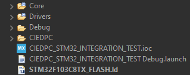
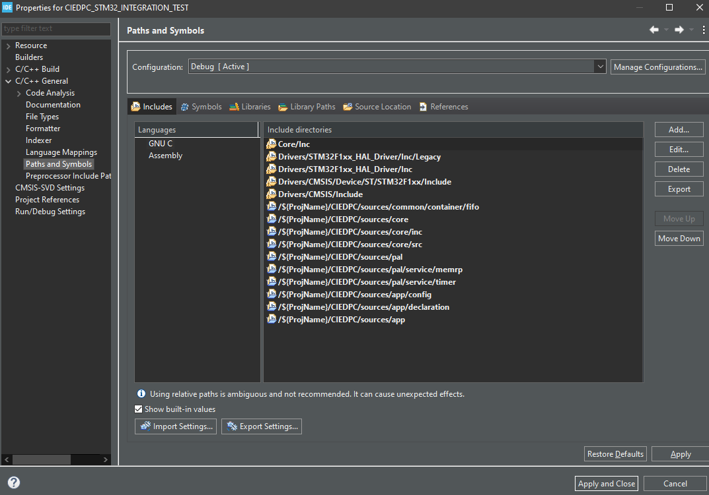

# Tài liệu hướng dẫn sử dụng CIEDPC

Tác giả: Shang Huang - Huỳnh Thanh Sang

Ngày hoàn thiện phiên bản đầu tiên: 2026-05-03

Phiên bản hiện tại: 1.0

## I. Giới thiệu chung

CIEDPC - Custom Independent Event Driven Programming Core là một module lõi được thiết kế để hỗ trợ mô hình lập trình hướng sự kiện (event-driven programming) trên các nền tảng nhúng. Mục tiêu của CIEDPC là cung cấp một giải pháp linh hoạt, dễ sử dụng và có khả năng mở rộng cho việc phát triển ứng dụng nhúng mà không phụ thuộc vào phần cứng cụ thể.

## II. Cấu trúc thư mục

```text
CIEDPC/
├── core/                        # Định nghĩa và triển khai logic chính của CIEDPC
│   ├── inc/                     # ciedpc_msg.h, ciedpc_task.h, ciedpc_timer.h, ciedpc_fsm.h, ciedpc_tsm.h
│   │   └── ciedpc_core.h        # Định nghĩa các tín hiệu, hằng số và cấu trúc dữ liệu cốt lõi của CIEDPC
│   └── src/                     # Triển khai logic scheduler, timer engine, message manager
├── pal/                         # BACKEND (Lớp trừu tượng)
│   ├── pal_core.h               # Khai báo thống nhất chung cho toàn bộ PAL và các dịch vụ hệ thống
│   ├── services/                # Hardware Services (Mapping phần cứng)
│   │   ├── timer/               # pal_timer.h chứa các khai báo API timer để tự triển khai trên từng nền tảng
│   │   └── memrp/               # pal_memrp.c/h chứa các hàm hỗ trợ memory profiling
│   └── arch/                    # Implementation (Mã nguồn chi tiết từng chip)
│       ├── stm32/               # stm32_arch.c/h chứa các hàm triển khai cho STM32
│       └── linux/               # linux_arch.c/h chứa các hàm triển khai cho môi trường giả lập trên Linux
├── app/                         # Định nghĩa logic ứng dụng, bao gồm các tác vụ và FSM do người dùng tạo ra
│   ├── config/                  # Chứa cấu hình ứng dụng và cấu hình người dùng
│   ├── task/                    # Định nghĩa các tác vụ (tasks) và FSM của người dùng
│   ├── declaration/             # Implementation chính của logic hoạt động của ứng dụng người dùng
│   └── interface/               # Định nghĩa và triển khai cổng giao tiếp với tín hiệu bên ngoài (task_if)
├── common/                      # Các tiện ích và cấu trúc dữ liệu chung được sử dụng trong toàn bộ dự án
│   └── container/               # Các cấu trúc dữ liệu như FIFO, Ring Buffer, Linked List được triển khai thuần C
└── test/                        # BUILD SYSTEM
    ├── test01/                  # Test cơ bản với các tác vụ ISR và TSM 
    ├── test02/                  # Test với các tính năng như message pooling và memrp
    └── test03/                  # Test tích hợp FSM phức tạp
```

## V. Hướng dẫn sử dụng

### Khai báo các giá trị TASK_NORM, TASK_POLL, SIG và STATE

Dựa theo dải tín hiệu, chúng ta thực hiện tham khảo trong testcase như sau:

- TASK_NORM thì khai báo từ `0xE6` đến `0xEE` (tránh dùng `0xEF` vì đã được định nghĩa là EOT).
- TASK_POLL thì khai báo từ `0xD4` đến `0xDE` (tránh dùng `0xDF` vì đã được định nghĩa là EOT).
- SIG thì khai báo từ `0x01` đến `0xFF` (tránh dùng các giá trị đã được định nghĩa sẵn trong các dải tín hiệu đặc biệt như FSM_SIG, TSM_SIG, TSM_STATE).

### Khai báo các message queue, buffer toàn cục, FSM và TSM

Người dùng nên khai báo các message queue và buffer toàn cục cho từng tác vụ trong implementation của từng test case để đảm bảo tính độc lập và dễ quản lý.

Ví dụ:

```c
static ciedpc_msg_t* usr_q_mem[8];
static ciedpc_msg_t* a_q_mem[8];
static ciedpc_msg_t* b_q_mem[8];

static const char* data_a_to_b = "Hello from Task A!";
static const char* data_b_to_a = "Hello from Task B!";

static ciedpc_tsm_t blinker_tsm;

static ciedpc_fsm_t fsm_usr;
static ciedpc_fsm_t fsm_a;
static ciedpc_fsm_t fsm_b;
```

Lưu ý rằng các buffer toàn cục này dùng cho việc chứa các message có kích thước quá lớn so với kích thước đã khai báo của pool, khi đó người dùng sẽ sử dụng cơ chế truyền tham chiếu để truyền địa chỉ của dữ liệu vào payload của message, do đó cần đảm bảo rằng các buffer này có phạm vi toàn cục để tránh lỗi truy cập bộ nhớ khi message được xử lý sau khi biến cục bộ đã hết phạm vi.

Ngoài ra, nên tuân thủ theo thứ tự khai báo là message queue, buffer toàn cục, TSM và FSM để đảm bảo tính nhất quán và dễ quản lý trong quá trình phát triển ứng dụng.

### Khai báo các handler cho Task, TSM và FSM

Nên khai báo - declaration các handler cho Task, TSM và FSM trong implementation của từng test case để đảm bảo tính độc lập và dễ quản lý.

Ví dụ:

```c
static void fn_on_active_exit(ciedpc_msg_t* msg);
static void fn_on_active_entry(ciedpc_msg_t* msg);

static void fn_on_idle_entry(ciedpc_msg_t* msg);

static void fn_active_logic(ciedpc_msg_t* msg);

static void usr_state_idle(ciedpc_msg_t* msg);
static void usr_state_active(ciedpc_msg_t* msg);

static void task_a_state_idle(ciedpc_msg_t* msg);
static void task_a_state_active(ciedpc_msg_t* msg);

static void task_b_state_idle(ciedpc_msg_t* msg);
static void task_b_state_active(ciedpc_msg_t* msg);

static void task_usr_handler(ciedpc_msg_t* msg);
static void task_a_handler(ciedpc_msg_t* msg);
static void task_b_handler(ciedpc_msg_t* msg);
```

Lưu ý, nên tuân thủ theo thứ tự khai báo là handler cho TSM, handler cho FSM và cuối cùng là handler cho Task để đảm bảo tính nhất quán và dễ quản lý trong quá trình phát triển ứng dụng.

### Khởi tạo TSM table và Task table

#### Khởi tạo TSM table

Trong TSM, mỗi một state sẽ có 1 bảng mô tả chuyển trạng thái là `tsm_trans_t` để định nghĩa

- Tín hiệu chuyển trạng thái
- Trạng thái chuyển tín hiệu tiếp theo
- Hàm logic cần thực thi khi chuyển trạng thái

Ví dụ:

```c
const tsm_trans_t blink_idle_trans[] = {
  { SIG_USR_START, STATE_BLINK_ACTIVE, NULL },
  { SIG_USR_STOP,  CIEDPC_TSM_STATE_STAY, NULL } 
};

const tsm_trans_t blink_active_trans[] = {
  { SIG_INTERNAL_TICK, CIEDPC_TSM_STATE_STAY, fn_active_logic },
  { SIG_USR_STOP,      STATE_BLINK_IDLE,      NULL },
  { SIG_USR_START,     CIEDPC_TSM_STATE_STAY, NULL }
};
```

Sau khi khai báo đầy đủ các bảng chuyển trạng thái thì sẽ tiến hành khai báo bảng mô tả trạng thái `tsm_state_desc_t` để định nghĩa những trạng thái mà TSM có thể có, trong đó sẽ liên kết mỗi trạng thái với hàm on_entry, on_exit và bảng chuyển trạng thái tương ứng.

Ví dụ:

```c
const tsm_state_desc_t blinker_tsm_table[] = {
  { STATE_BLINK_IDLE,   fn_on_idle_entry,   NULL,              blink_idle_trans,   1 },
  { STATE_BLINK_ACTIVE, fn_on_active_entry, fn_on_active_exit, blink_active_trans, 2 }
};
```

Lưu ý rằng mỗi một state không nhất thiết phải có hàm on_entry và on_exit, nếu không cần thiết thì có thể để là NULL. Tuy nhiên, bảng chuyển trạng thái và số lượng lượt chuyển trạng thái thì bắt buộc phải có để định nghĩa được logic chuyển trạng thái của TSM.

#### Khởi tạo Task table

Mỗi một tác vụ sẽ được định nghĩa trong bảng tác vụ `task_norm_t` với các thông tin như sau:

- ID của tác vụ
- Mức độ ưu tiên của tác vụ
- Handler của tác vụ
- Bộ nhớ dùng cho message queue của tác vụ

Ví dụ:

```c
task_norm_t app_task_table[] = {
  { CIEDPC_TASK_NORM_USR_ID,  CIEDPC_TASK_PRI_LEVEL_8, task_norm_usr_handler, {0}, usr_q_mem  },
  { TASK_NORM_A_ID,           CIEDPC_TASK_PRI_LEVEL_7, task_norm_a_handler,   {0}, a_q_mem    },
  { TASK_NORM_B_ID,           CIEDPC_TASK_PRI_LEVEL_6, task_norm_b_handler,   {0}, b_q_mem    },
  { CIEDPC_TASK_NORM_EOT_ID,  CIEDPC_TASK_PRI_LEVEL_0, NULL,                  {0}, NULL       }
};
```

Trong đó, tham số thứ 4 là FIFO nội bộ của task mà Core sẽ tự động khởi tạo dựa vào tham số thứ 5. Do đó ở đây tham số thứ 4 sẽ để là {0} để Core tự động khởi tạo FIFO dựa vào bộ nhớ đã khai báo ở tham số thứ 5.

Lưu ý rằng mỗi một tác vụ nên có mức độ ưu tiên khác nhau để đảm bảo rằng Core có thể xử lý tín hiệu một cách chính xác, nếu tất cả các tác vụ đều có cùng mức độ ưu tiên thì Core sẽ gặp lỗi xử lý tín hiệu, do đó cần lưu ý việc phân bổ mức độ ưu tiên cho các tác vụ trong hệ thống.

Ngoài ra `CIEDPC_TASK_NORM_USR_ID` chính là tác vụ mặc định mà người dùng sử dụng để truyền tín hiệu bắt đầu cho Core. Do đó nếu người dùng muốn sử dụng một tác vụ khác để truyền tín hiệu bắt đầu cho Core thì cần phải thay đổi lại ID của tác vụ này thành `CIEDPC_TASK_NORM_USR_ID` để đảm bảo rằng Core có thể nhận được tín hiệu bắt đầu và có mức ưu tiên cao nhất để được xử lý trước các tác vụ khác trong hệ thống.

### Khởi tạo Tick handler

Khởi tạo này phụ thuộc vào nền tảng và cách triển khai.

Ví dụ:

- Ở Linux thì sử dụng một thread riêng để thực hiện việc tick với độ trễ cố định, trong đó thread này sẽ gọi API `ciedpc_timer_tick()` của Core để cập nhật thời gian và xử lý các bộ định thời phần mềm.
- Ở STM32 thì gọi trực tiếp vào `SysTick_Handler()` để thực hiện việc tick, trong đó hàm này sẽ gọi API `ciedpc_timer_tick()` của Core để cập nhật thời gian và xử lý các bộ định thời phần mềm.
- Ở các nền tảng khác thì có thể sử dụng một bộ định thời phần cứng để tạo ra ngắt định kỳ, trong đó trong hàm xử lý ngắt này sẽ gọi API `ciedpc_timer_tick()` của Core để cập nhật thời gian và xử lý các bộ định thời phần mềm.

### Khởi tạo ứng dụng

Sau khi đã hoàn thành việc khai báo các handler, khởi tạo TSM table và Task table thì sẽ tiến hành khởi tạo ứng dụng theo các trình tự sau:

- Khởi tạo môi trường với `ciedpc_core_init()`, trong đó sẽ thực hiện cấu hình môi trường tùy thuộc theo nền tảng.
- Khởi tạo message pool với `ciedpc_msg_pool_init()`, trong đó sẽ thực hiện khởi tạo các pool bộ nhớ tĩnh dựa trên cấu hình đã khai báo trong PAL.
- Khởi tạo timer với `ciedpc_timer_init()`, trong đó sẽ thực hiện khởi tạo các bộ định thời phần mềm và thiết lập tick handler tùy thuộc theo nền tảng.
- Khởi tạo bảng tác vụ với `ciedpc_task_norm_create()`, trong đó sẽ thực hiện khởi tạo các tác vụ dựa trên bảng tác vụ đã khai báo, đồng thời thiết lập FIFO nội bộ cho từng tác vụ dựa trên bộ nhớ đã khai báo.
- Khởi tạo TSM và FSM với `ciedpc_tsm_init()` và `ciedpc_fsm_init()`, trong đó sẽ thực hiện khởi tạo các TSM và FSM dựa trên bảng mô tả trạng thái đã khai báo, đồng thời thiết lập trạng thái ban đầu cho từng TSM và FSM.
- Truyền tín hiệu khởi đầu vào `CIEDPC_TASK_NORM_USR_ID` với `ciedpc_post_msg()`, trong đó sẽ thực hiện truyền tín hiệu bắt đầu vào tác vụ mặc định của người dùng để kích hoạt hệ thống và bắt đầu xử lý các tín hiệu tiếp theo.
- Vòng lặp chính sẽ thực thi `ciedpc_task_scheduler()` để bắt đầu vòng lặp xử lý tín hiệu của hệ thống, trong đó Core sẽ liên tục kiểm tra và xử lý các tín hiệu từ các tác vụ dựa trên mức độ ưu tiên đã thiết lập, đồng thời quản lý các bộ định thời phần mềm và thực thi logic của TSM và FSM khi có tín hiệu tương ứng.

### Message Pool

Message Pool là lớp cấp phát và thu hồi message trong Core. Source hiện chia message thành các loại sau:

- `CIEDPC_MSG_TYPE_BLANK`: message không có payload.
- `CIEDPC_MSG_TYPE_NORM`: giá trị được định nghĩa trong enum nhưng hiện chưa được dựng thành pool riêng trong implementation hiện tại.
- `CIEDPC_MSG_TYPE_ALLOC`: message có payload nhỏ hoặc vừa, vùng data riêng.
- `CIEDPC_MSG_TYPE_EXTAL`: message từ interface ngoài Core.
- `CIEDPC_MSG_TYPE_ISR`: tín hiệu từ ngữ cảnh ngắt.

Khi khởi tạo bằng `ciedpc_msg_pool_init()`, Core dựng sẵn các pool tĩnh cho `BLANK`, `ALLOC`, `EXTAL` và một FIFO riêng cho `ISR`. Với `ALLOC` và `EXTAL`, vùng data được bố trí theo chiều 2D `[queue_size][data_size]` để mỗi message có ô dữ liệu riêng.

#### Cách dùng

1. Gọi `ciedpc_msg_pool_init()` sau `ciedpc_core_init()`.
2. Gọi `ciedpc_msg_alloc(des_task_id, sig, size)` để lấy message từ pool phù hợp.
3. Dùng `ciedpc_msg_set_data_val()` nếu muốn copy giá trị vào payload.
4. Dùng `ciedpc_msg_set_data_ref()` nếu muốn truyền tham chiếu đến dữ liệu có vòng đời đủ dài.
5. Dùng `ciedpc_msg_ref_inc()`/`ciedpc_msg_ref_dec()` khi một message được broadcast cho nhiều task.
6. Dùng `ciedpc_msg_free()` khi message không còn được dùng.

#### Điểm cần lưu ý

- `ciedpc_msg_alloc()` tự chọn pool theo kích thước payload, nên giá trị `size` phải phản ánh đúng nhu cầu dữ liệu.
- Nếu dùng truyền tham chiếu thì buffer tham chiếu phải còn sống sau thời điểm message được xử lý.
- `ciedpc_msg_drain_isr_pool()` là đường đi riêng cho tín hiệu ISR; không nên tự đẩy dữ liệu ISR vào queue task thường.
- Với `ALLOC` và `EXTAL`, `data` là con trỏ tới vùng nhớ riêng của từng message, không phải payload inline nằm ngay trong header.

### Task

Task trong CIEDPC có hai kiểu: message-driven và poll-driven.

#### Task message-driven

Task message-driven được khai báo bằng `task_norm_t` với 5 thành phần:

- `id`: ID task.
- `pri`: mức ưu tiên.
- `task_norm`: handler chính.
- `msg_queue`: FIFO nội bộ.
- `msg_queue_buffer`: buffer con trỏ cho FIFO.

Khi `ciedpc_task_norm_create()` chạy, Core sẽ tự khởi tạo FIFO cho mỗi task đến phần tử `CIEDPC_TASK_NORM_EOT_ID`. Kích thước hàng đợi mặc định lấy từ `CIEDPC_TASK_MSG_QUEUE_SIZE`.

`ciedpc_task_scheduler()` hiện chọn task có priority cao nhất đang ready, lấy đúng một message từ queue của task đó, dispatch handler, rồi giải phóng message sau khi handler chạy xong.

#### Task poll-driven

Task poll-driven được khai báo bằng `task_poll_t` với `id`, `ability`, và `task_poll`.

- `ciedpc_task_poll_create()` chỉ đếm danh sách đến `CIEDPC_TASK_POLL_EOT_ID`.
- `ciedpc_task_poll_set_ability()` bật/tắt task poll theo ID.
- Khi không có task message-driven nào ready, scheduler sẽ chạy các poll task đang bật.

#### API ngữ cảnh task

Trong lúc task đang chạy, có thể lấy ngữ cảnh hiện tại bằng:

- `ciedpc_task_norm_get_current_id()`
- `ciedpc_task_norm_get_current_msg()`

Các API này đặc biệt hữu ích cho itnlog vì logger lấy `task_id` và `msg_sig` từ ngữ cảnh hiện tại.

### ISR

ISR trong CIEDPC không nên xử lý logic phức tạp trực tiếp. Đường đi chuẩn là:

1. ISR gọi API đăng ký tín hiệu cho Core.
2. Core đưa cặp task ID + signal vào FIFO ISR nội bộ.
3. Ở đầu vòng scheduler, Core rút FIFO này và chuyển thành luồng xử lý bình thường.

Đường đi này được dùng chung cho tín hiệu từ timer tick và các ngắt khác.

Trong code hiện tại, `ciedpc_task_norm_post_isr()` là API dành riêng cho ISR, còn `ciedpc_timer_tick()` cũng dùng API này khi timer hết hạn để đưa tín hiệu về task đích.

### Timer

Timer Service của CIEDPC dùng pool cố định `CIEDPC_TIMER_MAX_NODES` node, không cấp phát heap.

#### Cách dùng khai báo

1. Gọi `ciedpc_timer_init()` sau khi khởi tạo Core.
2. Gọi `ciedpc_timer_set(task_id, sig, ms, type)` để tạo timer mới hoặc cập nhật timer đã tồn tại.
3. Gọi `ciedpc_timer_remove(task_id, sig)` để xóa timer.
4. Gọi `ciedpc_timer_tick()` trong ngữ cảnh tick định kỳ của nền tảng.

#### Hành vi thực tế

- `type` hiện hỗ trợ `CIEDPC_TIMER_ONE_SHOT` và `CIEDPC_TIMER_PERIODIC`.
- `ms` được quy đổi sang số tick bằng `CIEDPC_TIMER_TICK`.
- Khi timer hết hạn, Core phát sinh signal về task đích bằng đường đi ISR-safe.
- Với timer periodic, counter được nạp lại sau mỗi lần hết hạn; với one-shot, node được trả về free-list.

#### Tài nguyên

- Số timer tối đa đồng thời là `CIEDPC_TIMER_MAX_NODES`.
- `ciedpc_timer_get_stats()` cho phép kiểm tra số timer đang hoạt động và capacity tối đa.

### Trình tự khởi tạo khuyến nghị

Để phù hợp với source hiện tại, thứ tự khởi tạo nên là:

1. `ciedpc_core_init()`
2. `ciedpc_msg_pool_init()`
3. `ciedpc_timer_init()`
4. `ciedpc_task_norm_create()`
5. `ciedpc_task_poll_create()` nếu có poll task
6. `ciedpc_itnlog_init()` nếu dùng logger
7. `ciedpc_itnlog_set_output()` và các API cấu hình log khác nếu cần
8. Gửi message khởi đầu vào `CIEDPC_TASK_NORM_USR_ID`
9. Vòng lặp `ciedpc_task_scheduler()`

### Ví dụ về chương trình mẫu không phân tách khai báo

```c
#include "ciedpc_core.h"
#include "ciedpc_msg.h"
#include "ciedpc_task.h"
#include "ciedpc_timer.h"
#include "ciedpc_fsm.h"
#include "ciedpc_tsm.h"
#include "..."

// Khai báo các giá trị
#define TASK_NORM_A_ID 0xE6
#define TASK_NORM_B_ID 0xE7

#define SIG_A_TO_B 0x01
#define SIG_B_TO_A 0x02

#define STATE_A_IDLE 0xAF0
#define STATE_A_ACTIVE 0xAF1

#define STATE_B_IDLE 0xBF0
#define STATE_B_ACTIVE 0xBF1

// Khai báo các handler cho Task, TSM và FSM

static ciedpc_msg_t* usr_q_mem[8];
static ciedpc_msg_t* a_q_mem[8];
static ciedpc_msg_t* b_q_mem[8];

static const char* data_a_to_b = "Hello from Task A!";
static const char* data_b_to_a = "Hello from Task B!";

static ciedpc_tsm_t a_tsm;
static ciedpc_tsm_t b_tsm;

static ciedpc_fsm_t fsm_usr;
static ciedpc_fsm_t fsm_a;
static ciedpc_fsm_t fsm_b;

// Các handler cho TSM

static void fn_on_a_idle_entry(ciedpc_msg_t* msg);
static void fn_on_a_active_entry(ciedpc_msg_t* msg);
static void fn_on_a_active_exit(ciedpc_msg_t* msg);
static void fn_on_b_idle_entry(ciedpc_msg_t* msg);
static void fn_on_b_active_entry(ciedpc_msg_t* msg);
static void fn_on_b_active_exit(ciedpc_msg_t* msg);

// Các handler cho FSM

static void usr_state_idle(ciedpc_msg_t* msg);
static void usr_state_active(ciedpc_msg_t* msg);
static void task_a_state_idle(ciedpc_msg_t* msg);
static void task_a_state_active(ciedpc_msg_t* msg);
static void task_b_state_idle(ciedpc_msg_t* msg);
static void task_b_state_active(ciedpc_msg_t* msg);

// Các handler cho Task

static void task_usr_handler(ciedpc_msg_t* msg);
static void task_a_handler(ciedpc_msg_t* msg);
static void task_b_handler(ciedpc_msg_t* msg);

// Khởi tạo TSM table

const tsm_trans_t a_trans[] = {
  { SIG_A_TO_B, STATE_A_ACTIVE, NULL },
  { SIG_B_TO_A, STATE_A_IDLE, NULL },
};

const tsm_trans_t b_trans[] = {
  { SIG_B_TO_A, STATE_B_ACTIVE, NULL },
  { SIG_A_TO_B, STATE_B_IDLE, NULL },
};

const tsm_state_desc_t a_tsm_table[] = {
  { STATE_A_IDLE, fn_on_a_idle_entry, NULL, a_trans, 2 },
  { STATE_A_ACTIVE, fn_on_a_active_entry, fn_on_a_active_exit, a_trans, 2 }
};

const tsm_state_desc_t b_tsm_table[] = {
  { STATE_B_IDLE, fn_on_b_idle_entry, NULL, b_trans, 2 },
  { STATE_B_ACTIVE, fn_on_b_active_entry, fn_on_b_active_exit, b_trans, 2 }
};

// Khởi tạo Task table

task_norm_t app_task_table[] = {
  { CIEDPC_TASK_NORM_USR_ID,  CIEDPC_TASK_PRI_LEVEL_8, task_usr_handler, {0}, usr_q_mem  },
  { TASK_NORM_A_ID,           CIEDPC_TASK_PRI_LEVEL_7, task_a_handler,   {0}, a_q_mem    },
  { TASK_NORM_B_ID,           CIEDPC_TASK_PRI_LEVEL_6, task_b_handler,   {0}, b_q_mem    },
  { CIEDPC_TASK_NORM_EOT_ID,  CIEDPC_TASK_PRI_LEVEL_0, NULL,              {0}, NULL       }
};

// Khởi tạo Tick handler

<Tùy thuộc vào nền tảng và cách triển khai đã đề cập ở phần hướng dẫn sử dụng>

// Hàm main

int main() {

  // Khởi động Core
  ciedpc_core_init();

  // Khởi tạo Message Pool, Timer và Task
  ciedpc_msg_pool_init();
  ciedpc_timer_init();
  ciedpc_task_norm_create(app_task_table);

  // Khởi tạo TSM cho task A
  ciedpc_tsm_init(&a_tsm, a_tsm_table, STATE_A_IDLE, NULL);
  
  // Khởi tạo TSM cho task B
  ciedpc_tsm_init(&b_tsm, b_tsm_table, STATE_B_IDLE, NULL);

  // Khởi tạo FSM cho task USR
  ciedpc_fsm_init(&fsm_usr, usr_state_idle);
  
  // Khởi tạo FSM cho task A
  ciedpc_fsm_init(&fsm_a, task_a_state_idle);

  // Khởi tạo FSM cho task B
  ciedpc_fsm_init(&fsm_b, task_b_state_idle);

  // Truyền tín hiệu khởi đầu vào task USR để kích hoạt hệ thống
  ciedpc_msg_t* start_msg = ciedpc_msg_alloc(CIEDPC_TASK_NORM_USR_ID, SIG_USR_START, 0);
  ciedpc_task_norm_post_msg(CIEDPC_TASK_NORM_USR_ID, start_msg);

  while (1) {
    ciedpc_task_scheduler();
    usleep(100); // Sleep để tránh CPU hogging
  }

  return 0;
}

// Các handler cho TSM, FSM và Task sẽ được định nghĩa ở đây, trong đó sẽ thực hiện logic xử lý tín hiệu và quản lý trạng thái của TSM và FSM tương ứng với từng tác vụ.

```

### Ví dụ về chương trình mẫu phân tách khai báo trên STM32CubeIDE

Ở file `app_decl.h`:

```c
/**
 * @file app_decl.h
 * @author Shang Huang
 * @brief Application declaration header file
 * @version 0.1
 * @date 2026-05-07
 * 
 * @copyright Copyright (c) 2026
 * 
 */
#ifndef __APP_DECL_H__
 #define __APP_DECL_H__

 /**
  * @brief Khai báo thư viện sử dụng
  */

 #include "ciedpc_core.h"
 #include "ciedpc_task.h"
 #include "ciedpc_tsm.h"
 #include "ciedpc_fsm.h"
 #include "ciedpc_msg.h"
 #include "ciedpc_timer.h"

 /**
  * @brief Khai báo tác vụ
  */

 #define TASK_NORM_A_ID    (0xE6)
 #define TASK_NORM_B_ID    (0xE7)

 /**
  * @brief Khai báo tín hiệu giao tiếp giữa các tác vụ
  */

 #define SIG_USR_START     (0x01u)
 #define SIG_USR_STOP      (0x02u)
 #define SIG_TSK_A_TO_B    (0x03u)
 #define SIG_TSK_B_TO_A    (0x04u)

 /**
  * @brief Khai báo message queue cho các tác vụ
  * @attention Mỗi tác vụ sẽ có một hàng đợi tin nhắn riêng biệt
  *       Tùy thuộc vào nhu cầu của ứng dụng để điều chỉnh kích thước của hàng đợi, 
  *       nhưng cần đảm bảo không vượt quá giới hạn của hệ thống CIEDPC
  */

 extern ciedpc_msg_t* usr_q_mem[8];
 extern ciedpc_msg_t* a_q_mem[8];
 extern ciedpc_msg_t* b_q_mem[8];

 /**
  * @brief Khai báo biến đếm hoạt động của hệ thống
  * @attention Nên khuyến khích sử dụng biến này để theo dõi số lượng hành động 
  *       đã thực hiện trong hệ thống khi task_scheduler được gọi,
  *       đặc biệt hữu ích trong các bài test để xác nhận rằng hệ thống đang hoạt động như mong đợi 
  *       và để phát hiện các vấn đề tiềm ẩn như vòng lặp vô hạn hoặc tắc nghẽn trong scheduler.
  */

 extern uint32_t system_action_count;

 /**
  * @brief Khai báo các hàm handler cho các task
  */

 void task_norm_usr_handler(ciedpc_msg_t* msg);
 void task_norm_a_handler(ciedpc_msg_t* msg);
 void task_norm_b_handler(ciedpc_msg_t* msg);
 void task_poll_memrp_handler();

 /**
  * @brief Khai báo các hàm on-entry/exit cho các trạng thái FSM (nếu có)
  */

 /**
  * @brief Khai báo các hàm on-state cho các trạng thái TSM (nếu có)
  */

 /**
  * @brief Khai báo các state_handler cho các trạng thái FSM (nếu có)
  */

#endif //__APP_DECL_H__
```

Ở file `app_cfg.h`:

```c
/**
 * @file app_cfg.h
 * @author Shang Huang
 * @brief Application configuration header file
 * @version 0.1
 * @date 2026-05-07
 * 
 * @copyright Copyright (c) 2026
 * 
 */
#ifndef __APP_CFG_H__
 #define __APP_CFG_H__

 /**
  * @brief Khai báo thư viện sử dụng
  */

 #include "ciedpc_task.h"
 #include "ciedpc_tsm.h"
 #include "ciedpc_fsm.h"

 /**
  * @brief Khai báo danh sách tác vụ và tác vụ polling của ứng dụng
  */

 extern task_norm_t app_task_table[];
 extern task_poll_t app_poll_table[];

 /**
  * @brief Định nghĩa bảng chuyển trạng thái cho state
  * @attention Với n state thì có n bảng chuyển trạng thái
  * @note Người dùng tự định nghĩa bảng, có thể xóa dòng 24 và thay thế bằng
  *     triển khai của người dùng hoặc có thể giữ nguyên nếu không sử dụng TSM
  */

 extern const tsm_trans_t state_trans_table[];

 /**
  * @brief Định nghĩa bảng TSM cho task Blinker
  * @attention Với n state thì có n entry trong bảng TSM
  * @note Người dùng tự định nghĩa bảng, có thể xóa dòng 35 và thay thế bằng
  *     triển khai của người dùng hoặc có thể giữ nguyên nếu không sử dụng TSM
  */

 extern const tsm_state_desc_t tsm_table[];

 /**
  * @brief Định nghĩa TSM cho tác vụ
  * @attention Với n tác vụ sử dụng TSM thì có n định nghĩa TSM.
  *       Tuy nhiên mỗi task không nhất thiết phải sử dụng TSM
  * @note Người dùng tự định nghĩa TSM, có thể xóa dòng 45 và thay thế bằng
  *     triển khai của người dùng hoặc có thể giữ nguyên nếu không sử dụng TSM cho tác vụ
  */

 extern ciedpc_tsm_t app_tsm;

 /**
  * @brief Định nghĩa FSM cho tác vụ
  * @attention Với n tác vụ sử dụng FSM thì có n định nghĩa FSM.
  *       Tuy nhiên mỗi task không nhất thiết phải sử dụng FSM
  * @note Người dùng tự định nghĩa FSM, có thể xóa dòng 55 và thay thế bằng
  *     triển khai của người dùng hoặc có thể giữ nguyên nếu không sử dụng FSM cho tác vụ
  */

 extern ciedpc_fsm_t app_fsm;

#endif //__APP_CFG_H__
```

Ở file `app.c`:

```c
/**
 * @file app.c
 * @author Shang Huang
 * @brief Application main source file
 * @version 0.1
 * @date 2026-05-07
 * @copyright MIT License
 */

/**
 * @brief Khai báo thư viện sử dụng
 */

#include "app_cfg.h"
#include "app_decl.h"
#include "ciedpc_core.h"
#include "ciedpc_task.h"
#include "ciedpc_msg.h"
#include "ciedpc_timer.h"
#include "pal_memrp.h"

/**
 * @brief Định nghĩa biến đếm hành động của hệ thống
 */

uint32_t system_action_count = 0x0u;

/**
 * @brief Ủy quyền sử dụng message queue cho các tác vụ đã khai báo trong app_decl.h
 */

ciedpc_msg_t* usr_q_mem[8];
ciedpc_msg_t* a_q_mem[8];
ciedpc_msg_t* b_q_mem[8];

/**
 * @brief Định nghĩa các chuỗi dữ liệu để truyền giữa Task A và Task B
 */

const char* data_a_to_b = "Hello from Task A!";
const char* data_b_to_a = "Hello from Task B!";
```

```c
/**
 * @brief Định nghĩa bảng task 
 */

task_norm_t app_task_table[] = {
  { CIEDPC_TASK_NORM_USR_ID,  CIEDPC_TASK_PRI_LEVEL_8, task_norm_usr_handler, {0}, usr_q_mem  },
  { TASK_NORM_A_ID,           CIEDPC_TASK_PRI_LEVEL_7, task_norm_a_handler,   {0}, a_q_mem    },
  { TASK_NORM_B_ID,           CIEDPC_TASK_PRI_LEVEL_6, task_norm_b_handler,   {0}, b_q_mem    },
  { CIEDPC_TASK_NORM_EOT_ID,  CIEDPC_TASK_PRI_LEVEL_0, NULL,                  {0}, NULL       }
};

task_poll_t app_poll_table[] = {
  { CIEDPC_TASK_POLL_MEMRP_ID , 0, task_poll_memrp_handler },
  { CIEDPC_TASK_POLL_EOT_ID, 0, NULL }
};

/**
 * @brief Định nghĩa handler cho task USR, task A và task B
 */

void task_norm_usr_handler(ciedpc_msg_t* msg) {
  if (msg->sig == SIG_USR_START) {
    printf("[USR] Received START signal. Sending message to Task A...\n");
    ciedpc_msg_t* msg_to_a = ciedpc_msg_alloc(TASK_NORM_A_ID, SIG_USR_START, 0);
    ciedpc_task_norm_post_msg(TASK_NORM_A_ID, msg_to_a);
    system_action_count++;
  } else if (msg->sig == SIG_USR_STOP) {
    printf("[USR] Received STOP signal. Stopping the system...\n");
    // Thực hiện các hành động cần thiết để dừng hệ thống, có thể là gửi tín hiệu đến các tác vụ khác để dừng chúng
    system_action_count++;
  }
}
```

```c
void task_norm_a_handler(ciedpc_msg_t* msg) {
  switch (msg->sig) {
  case SIG_USR_START:
    printf("[Task A] Received START signal from USR. Sending message to Task B...\n");
    ciedpc_msg_t* msg_to_b = ciedpc_msg_alloc(TASK_NORM_B_ID, SIG_TSK_A_TO_B, sizeof(char*));
    ciedpc_msg_set_data_ref(msg_to_b, (char*)&data_a_to_b); // Truyền địa chỉ của chuỗi dữ liệu
    ciedpc_task_norm_post_msg(TASK_NORM_B_ID, msg_to_b);
    printf("[Task A] Message sent to Task B. Waiting for response...\n");
    system_action_count++;
    break;
  case SIG_TSK_B_TO_A:
    printf("[Task A] Received message from Task B\n");
    uintptr_t received_addr = (uintptr_t)(*(char**)(msg->data));
    char* final_str = *(char**)received_addr;
    printf("[Task A] Content: %s\n", final_str);
    printf("[Task A] Sending STOP signal to USR...\n");
    ciedpc_msg_t* stop_msg = ciedpc_msg_alloc(CIEDPC_TASK_NORM_USR_ID, SIG_USR_STOP, 0);
    ciedpc_task_norm_post_msg(CIEDPC_TASK_NORM_USR_ID, stop_msg);
    printf("[Task A] Sent STOP signal to USR. Exiting...\n");
    system_action_count++;
    break;
  default:
    break;
  }
}

void task_norm_b_handler(ciedpc_msg_t* msg) {
  switch (msg->sig) {
  case SIG_TSK_A_TO_B:
    printf("[Task B] Received message from Task A.\n");
    uintptr_t received_addr = (uintptr_t)(*(char**)(msg->data));
    char* final_str = *(char**)received_addr;
    printf("[Task B] Content: %s\n", final_str);
    printf("[Task B] Sending message back to Task A...\n");
    ciedpc_msg_t* msg_to_a = ciedpc_msg_alloc(TASK_NORM_A_ID, SIG_TSK_B_TO_A, sizeof(char*));
    ciedpc_msg_set_data_ref(msg_to_a, (char*)&data_b_to_a);
    /**
     * @brief Thử nghiệm việc truyền địa chỉ làm dữ liệu của tin nhắn,
     *        Giảm tải bộ nhớ bằng cách không sao chép dữ liệu mà chỉ truyền địa chỉ của biến chứa dữ liệu,
     */
    ciedpc_task_norm_post_msg(TASK_NORM_A_ID, msg_to_a);
    printf("[Task B] Message sent back to Task A. Waiting for next message...\n");
    system_action_count++;
    break;
  default:
    break;
  }
}

void task_poll_memrp_handler() {
  pal_memrp_report(&(pal_memrp_info_t){ .type = CIEDPC_MSG_TYPE_BLANK});
  pal_memrp_report(&(pal_memrp_info_t){ .type = CIEDPC_MSG_TYPE_ALLOC});
  pal_memrp_report(&(pal_memrp_info_t){ .type = CIEDPC_MSG_TYPE_EXTAL});
  pal_memrp_report(&(pal_memrp_info_t){ .type = CIEDPC_MSG_TYPE_ISR});
  ui32 rom_used = 0x0u;
  ui32 ram_used = 0x0u;
  ui32 stack_curr = 0x0u;
  pal_memrp_get_sys_info(&rom_used, &ram_used, &stack_curr);
  ciedpc_task_poll_set_ability(CIEDPC_TASK_POLL_MEMRP_ID, false);
  system_action_count++;
}

/**
 * @brief Định nghĩa các hàm on-entry/exit cho các trạng thái của TSM (nếu có)
 */

/**
 * @brief Định nghĩa các state handler cho FSM của task USR, task A và task B (nếu có)
 */

```

Ở file `main.c`, STM32CubeMX đã tự động tạo ra hàm `main()` và các hàm khởi tạo hệ thống, do đó người dùng chỉ cần thêm vào phần khởi tạo ứng dụng và vòng lặp chính để chạy scheduler.

## VI. Cài đặt CIEDPC trên STM32 project với STM32CubeIDE

Lưu ý: các hướng dẫn này dựa theo cấu hình của Linux trên STM32. Do đó sẽ có một số bước cấu hình câu lệnh khác so với Windows, tuy nhiên về logic thì vẫn tương tự nhau.

Sau khi hoàn thiện các bước tạo project, người dùng có thể tham khảo cách cài đặt CIEDPC vào project STM32 như sau:

Tại thư mục chứa project của STM32, ta thực hiện clone CIEDPC repo:

```bash
git clone https://github.com/1811htsang/CIEDPC-Custom-Independent-Event-Driven-Programming-Core.git <Tên thư mục mong muốn - ví dụ: ciedpc>
```

Để tránh các rắc rối về version control khi đã clone CIEDPC vào project của STM32 thì ta nên xóa đi thư mục `.git` trong thư mục CIEDPC vừa clone:

```bash
cd <Tên thư mục vừa clone - ví dụ: ciedpc>
rm -rf .git
```

Khi hoàn thành, ta sẽ có cấu trúc thư mục gốc như sau:



Sau đó, trên STM32 project, ta tiến hành thêm các file header và source của CIEDPC vào project để có thể sử dụng được các API của CIEDPC trong quá trình phát triển ứng dụng.

Chọn `Project` -> `Properties` -> `C/C++ General` -> `Paths and Symbols` -> `Includes` -> `GNU C` -> `Add...` và thêm đường dẫn đến thư mục chứa các file header của CIEDPC (ví dụ: `$(PROJECT_DIR)/<Tên thư mục vừa clone - ví dụ: ciedpc>/include`).

Tham khảo theo hình dưới đây:



Lưu ý rằng, sử dụng đường dẫn khái quát nhằm mục đích include toàn bộ các file header & implementation sẽ không hỗ trợ trên cấu hình của STM32CubeIDE. Do đó cần phải thêm từng file header và source cụ thể vào project để đảm bảo rằng các API của CIEDPC có thể được sử dụng một cách chính xác trong quá trình phát triển ứng dụng trên STM32.

Sau đó, bên cạnh mục `Includes`, ta bổ sung cấu hình của `Source Location` để thêm đường dẫn đến thư mục chứa các file source của CIEDPC (ví dụ: `$(PROJECT_DIR)/<Tên thư mục vừa clone - ví dụ: ciedpc>/src`). Cần đảm bảo loại bỏ các thư mục test và các cấu hình của arch khác để tránh lỗi biên dịch do có các file source không tương thích với nền tảng STM32.

Tham khảo theo hình dưới đây:


Tiếp đến cấu hình các handler quan trọng như `SysTick_Handler()` và `HardFault_Handler()` để xử lý các API của Core liên quan đến timer tick và xử lý lỗi hệ thống. Cần đảm bảo rằng các handler này được cấu hình đúng cách để đảm bảo rằng hệ thống có thể hoạt động một cách ổn định và hiệu quả trên nền tảng STM32.

Ví dụ như đã cấu hình trong `stm32_arch`:

```c
void SysTick_Handler(void) {
 HAL_IncTick();
 if (is_inited == 0x1u) {
  ciedpc_timer_tick();
 }
}

__attribute__((naked)) void HardFault_Handler(void) {
    __asm volatile (
        "tst lr, #4 \n"
        "ite eq \n"
        "mrseq r0, msp \n"
        "mrsne r0, psp \n"
        "b internal_hardfault_decoder \n"
    );
}
```

Lưu ý rằng, sau khi hoàn thành cấu hình trong `stm32_arch` thì cần đảm bảo các implementation trong `Core/src/stm32f1xxx_it.c` được cập nhất các handler đã re-implement trong `stm32_arch` thành `__weak` để tránh lỗi trùng lặp định nghĩa khi biên dịch.

## Các lưu ý quan trọng

- Việc phân bổ mức độ ưu tiên cho các tác vụ là rất quan trọng để đảm bảo rằng Core có thể xử lý tín hiệu một cách chính xác. Nếu tất cả các tác vụ đều có cùng mức độ ưu tiên thì Core sẽ gặp lỗi xử lý tín hiệu, do đó cần lưu ý việc phân bổ mức độ ưu tiên cho các tác vụ trong hệ thống.
- Khi sử dụng cơ chế truyền tham chiếu để truyền địa chỉ của dữ liệu vào payload của message, cần đảm bảo rằng các buffer chứa dữ liệu này có phạm vi toàn cục để tránh lỗi truy cập bộ nhớ khi message được xử lý sau khi biến cục bộ đã hết phạm vi.
- Trong thiết kế TSM, việc sử dụng cơ chế "Stay" và "Back" giúp tối ưu hóa hiệu suất và tránh lặp lại các hàm on_entry và on_exit không cần thiết, tuy nhiên cần lưu ý rằng việc sử dụng cơ chế này cần phải được thực hiện một cách cẩn thận để đảm bảo rằng logic chuyển trạng thái vẫn được duy trì một cách chính xác và không gây ra lỗi logic trong hệ thống.
- Khi thiết kế FSM, việc sử dụng mô hình Pointer-Swapping giúp đạt được sự linh hoạt tối đa, tuy nhiên cần lưu ý rằng việc thay đổi logic xử lý ngay lập tức chỉ bằng một phép gán con trỏ có thể dẫn đến lỗi nếu không được quản lý cẩn thận, do đó cần đảm bảo rằng các trạng thái và logic xử lý được thiết kế một cách rõ ràng và dễ hiểu để tránh nhầm lẫn và lỗi logic trong hệ thống.
- Trong quá trình phát triển ứng dụng, nên tuân thủ theo các hướng dẫn và cấu trúc đã đề ra để đảm bảo tính nhất quán và dễ quản lý trong hệ thống, đồng thời nên thường xuyên kiểm tra và debug để đảm bảo rằng hệ thống hoạt động một cách ổn định và hiệu quả.

### Itnlog - Hệ thống logging

Itnlog là cơ chế logging nội bộ của CIEDPC, phù hợp cho cả debug trên Linux lẫn các nền tảng nhúng không muốn phụ thuộc hoàn toàn vào `printf` rải rác trong luồng xử lý.

#### Cách dùng cơ bản

1. Gọi `ciedpc_itnlog_init()` sau khi đã khởi tạo Core và trước khi bắt đầu chạy scheduler.
2. Đăng ký một wrapper xuất log bằng `ciedpc_itnlog_set_output()`.
3. Gọi `ciedpc_itnlog_log()` ở nơi cần ghi nhận sự kiện.
4. Gọi `ciedpc_itnlog_dump()` khi muốn in toàn bộ log đang có trong bộ đệm.

Ví dụ cấu hình trên Linux:

```c
static void itnlog_stdout_output(const char* text) {
  printf("%s", text);
  fflush(stdout);
}

int main(void) {
  ciedpc_core_init();
  ciedpc_msg_pool_init();
  ciedpc_timer_init();

  ciedpc_itnlog_init();
  ciedpc_itnlog_set_output(itnlog_stdout_output);
  ciedpc_itnlog_set_filter(ITNLOG_LEVEL_DEBUG, ITNLOG_TAG_TSK);

  ...
}
```

Lưu ý quan trọng: `ciedpc_itnlog_set_output()` nhận một hàm có chữ ký `void (*)(const char*)`. Vì vậy không nên truyền trực tiếp `printf` vào API này, mà nên bọc `printf` hoặc `fputs` trong một wrapper như ví dụ trên.

#### Định dạng dòng log

Khi dump, mỗi entry được ghép thành một dòng theo mẫu:

```text
[ITNLOG] tmstmp task_id msg_id msg
```

Trong đó `task_id` và `msg_id` được xuất ở dạng hex để dễ map với ID nội bộ của Core. `msg_id` chính là `msg_sig` của message hiện tại khi log được ghi. Ví dụ:

```text
[ITNLOG] 0 0xE4 0x01 System is alive and running...
```

#### Lọc theo tag

Nếu cần lọc log theo module, dùng `ciedpc_itnlog_set_tag("TSK")`, `ciedpc_itnlog_set_tag("MSG")`, `ciedpc_itnlog_set_tag("FSM")`, `ciedpc_itnlog_set_tag("TSM")`, hoặc `ciedpc_itnlog_set_tag("TIM")`.

Lưu ý:

- `NULL` có nghĩa là không lọc theo tag.
- Khi xuất ra terminal, nên dùng một wrapper riêng thay vì truyền trực tiếp `printf` làm callback để tránh lỗi do khác kiểu chữ ký hàm và để chủ động flush `stdout`.
- `ciedpc_itnlog_log()` lấy `task_id` từ task hiện tại và lấy `msg_sig` từ message hiện tại, nên chỉ nên gọi khi đang ở trong ngữ cảnh scheduler xử lý message hợp lệ.

#### Lưu ý khi debug

- Nếu log chưa hiện ngay trên terminal, kiểm tra callback output có flush `stdout` hay không.
- Nếu muốn in log theo thời điểm nhất định, có thể gọi `ciedpc_itnlog_dump()` trong polling task hoặc ngay trước khi kết thúc testcase.
- `ciedpc_itnlog_log()` chỉ ghi vào bộ đệm nội bộ, còn việc hiển thị phụ thuộc vào callback output và thời điểm dump.
- Nếu buffer log đầy, `ciedpc_itnlog_log()` sẽ làm logger tự dump trước khi ghi tiếp theo thiết kế hiện tại trong source.
